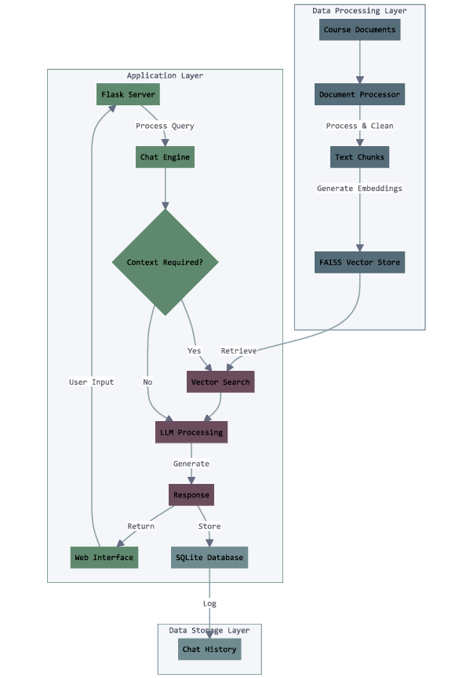

# UNH Manchester Course Internship Assistant Chatbot

## Overview
This project implements a specialized chatbot designed to assist UNH Manchester students with internship-related queries. The chatbot utilizes Retrieval-Augmented Generation (RAG) to provide accurate, context-aware responses about internship courses, requirements, and procedures.

## System Architecture
Below is the system architecture diagram showing the flow of data through our application:

The system consists of three main layers:
1. **Data Processing Layer**: Handles document ingestion and preparation
2. **Application Layer**: Manages user interactions and query processing
3. **Data Storage Layer**: Maintains chat history
## Technology Stack
- **Frontend**: Flask web interface
- **Backend**: Python with LangChain framework
- **LLM**: OpenAI GPT-4 Turbo for natural language processing
- **Vector Storage**: FAISS for efficient document retrieval
- **Database**: SQLite for chat history
- **Deployment**: Amazon EC2

## Key Features
- Domain-specific responses about UNH Manchester internship programs
- Course recommendation based on student situations
- Chat history tracking and analytics
- Document processing and intelligent retrieval
- Deployment on AWS cloud infrastructure

## Project Structure
```
project/
├── src/
│   ├── ragllm.py
│   ├── templates/
│   │   └── index.html
│   └── materials/
│       └── course_docs/
├── embeddings/
├── chat_history.db
├── requirements.txt
└── README.md
```

## Prerequisites
- Python 3.7+
- OpenAI API key
- AWS account for EC2 deployment

## Dependencies
```
flask
langchain
langchain-openai
faiss-cpu
python-dotenv
tqdm
openai
sqlite3
```

## Local Setup
1. Clone the repository
2. Create and activate a virtual environment:
   ```bash
   python -m venv venv
   source venv/bin/activate  # Unix/macOS
   venv\Scripts\activate     # Windows
   ```
3. Install dependencies:
   ```bash
   pip install -r requirements.txt
   ```
4. Set up your OpenAI API key in a `.env` file:
   ```
   OPENAI_API_KEY=your_api_key_here
   ```
5. Run the application:
   ```bash
   python src/ragllm.py
   ```

## EC2 Deployment
1. Launch an EC2 instance (t2.micro or larger recommended)
2. Configure security groups to allow inbound traffic on port 5000
3. SSH into your instance:
   ```bash
   ssh -i your-key.pem ec2-user@your-instance-ip
   ```
4. Install dependencies:
   ```bash
   sudo yum update -y
   sudo yum install python3 python3-pip git -y
   ```
5. Clone and set up the project:
   ```bash
   git clone [repository-url]
   cd [project-directory]
   python3 -m venv venv
   source venv/bin/activate
   pip install -r requirements.txt
   ```
6. Run the application using screen or systemd:
   ```bash
   screen -S chatbot
   python3 src/ragllm.py
   ```
   Press `Ctrl+A+D` to detach from screen

## Usage
1. Access the chatbot through your browser:
   - Local: `http://localhost:5000`
   - EC2: `http://your-ec2-ip:5000`
2. Type your internship-related questions in the chat interface
3. The chatbot will provide relevant information based on course materials

## Features
- Course recommendation based on student status (working, seeking internship, etc.)
- Information about course requirements and prerequisites
- Guidance on internship registration process
- CPT authorization assistance for international students
- Chat history tracking and analytics

## Contributing
1. Fork the repository
2. Create a feature branch
3. Commit your changes
4. Push to the branch
5. Create a Pull Request

